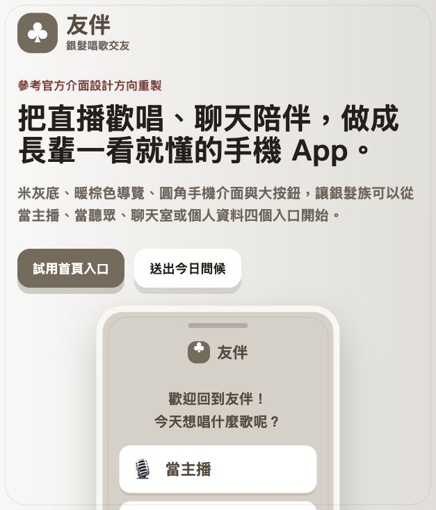
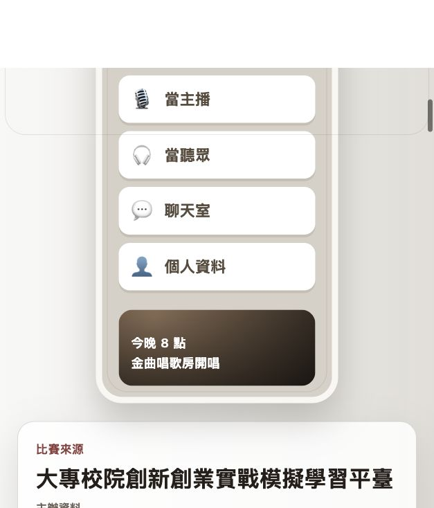

# 友伴 - 銀髮族唱歌交友 App Demo

## 快速看懂

- 線上 Demo：https://atlasforcn.github.io/startup-youbuddy-singing-social/
- 這個原型在做什麼：把友伴做成銀髮族唱歌交友 App。
- 特色定位：特色是參考官方公開介面方向，放大唱歌房、聊天室、點歌和安心互動流程。
- 操作流程：選擇唱歌房或點歌內容 → 在聊天室送出暖心話或安排 Call-in → 用安全設定管理互動界線與陪伴紀錄

展開完整功能流程截圖

這是一個原生 HTML/CSS/JavaScript 製作的互動 demo，根據教育部「大專校院創新創業實戰模擬學習平臺」成功案例資訊整理與延伸設計。

本 demo 參考官方案例頁公開的介面設計方向，但不直接使用原團隊素材。

## 比賽來源

- 平臺：大專校院創新創業實戰模擬學習平臺
- 單位：教育部
- 屆次 / 階段：114 年，第一梯次成功案例
- 學校：國立成功大學
- 團隊 / 作品：友伴-銀髮族唱歌交友app
- 公司 / 團隊：友伴
- 領域：服務文創領域
- 官方來源：https://ssp.moe.gov.tw/cases/1441

## 核心概念

友伴是一款面向銀髮族的社交 App，以「唱歌」作為最自然、最容易開口的互動起點，結合唱歌房、Call-in、聊天室、安全互動與陪伴紀錄，降低熟齡使用者認識新朋友的壓力，也讓互動更有界線與延續性。

## Demo 範圍

此 demo 聚焦在產品體驗原型，不包含後端、登入、真實語音串流或資料庫。

- 唱歌房清單：可依懷舊金曲、台語、對唱、新手友善等條件篩選並加入房間。
- 房間互動：加入祝訊唱歌房、金曲唱歌房或閒聊房後，可查看主持人、黑底歌詞、排唱狀態、聊天室訊息，並送出暖心話。
- 點歌頁：可搜尋歌曲，透過播放 / 點歌按鈕更新 Live room 的歌曲與歌詞。
- 陪伴 / 好友配對：依共同歌單、所在地、可通話時間與互動界線送出問候或安排 Call-in。
- 安全互動：可切換已驗證會員、先文字再語音、關懷通知與安心話題。
- 活動與通話紀錄：記錄加入房間、問候、Call-in、排程與安全設定變更。

## 免責聲明

這是依公開得獎資訊與官方案例頁公開介面方向自行製作的興趣原型，不是原團隊官方 demo 或產品，也不代表原團隊、學校或主辦單位立場。

## 使用方式

直接用瀏覽器開啟 `index.html` 即可使用。專案不需要建置工具或套件安裝。
